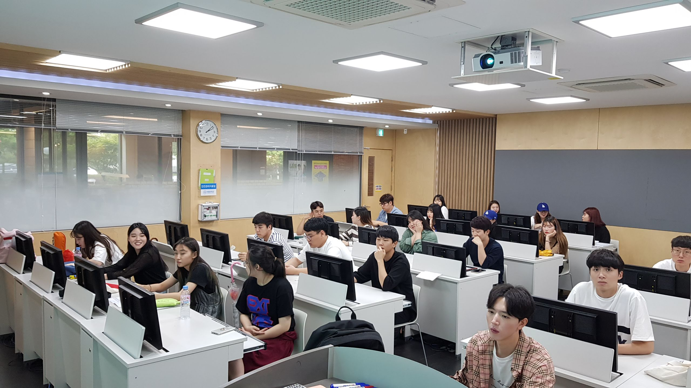

# PHP 정규수업 2018-2
강좌명 : 스마트컨덴츠 응용
진행 : 이호진

## 소개
PHP 내장 웹서버를 통해 모든 테스트를 설치 환경에서 실습하고 학습합니다.  
코드를 최대한 적게 사용하면서도 PHP 학습을 할 수 있도록 합니다. 
팀 프로젝트를 통해 응용 프로그램을 개발해봄으로써 PHP 활용 방법에 대해 이해합니다.  
내장된 함수들을 유사한 기능들 중심으로 학습합니다. JSON 등 기본함수들을 통하여 실제 작업을 할 수 있도록 
예제를 구성하여서 함수를 적재적소에 사용하여 업무 속도를 높이려는 개발자에 한발짝 더 다가갈 수 있습니다.

## 강의진행

1. 언어의 개념과 PHP시장성,방향에 대해서 설명합니다. 기본 실습환경을 구축합니다.
2. 기본구문 및 코딩 작성 스타일에 대해서 학습을합니다.
3. 메모리에 대한개념, 상수와 변수체계에 대해서 학습을 합니다.
4. 제어문, 반복문등 절차적 순서 프로그램에 대해서 학습을 합니다.
5. 함수형 프로그램밍에 대한 코드를 학습합니다.
6. 스코프 처리개념에 대해서 학습을 합니다. 또한 파일 분할 라이브러리처리에 대해서 학습을 합니다.
7. 웹 서비스 처리에 대한 쿠키,세션처리에 대해서 학습을 합니다.
9. 객체 지향 클래스의 개념을 학습합니다.
10. 모던 스타일의 OOP개념을 확장하여 학습을 합니다.
11. 예외처리,오류에 대한처리를 학습 합니다.
12. 기본 웹폼,HTML 및 서버처리에 대해서 학습을 합니다.
13. 파일 처리에 대해서 학습을 합니다.
14. json, curl 클로링등에 대해서 학습을 합니다.

## 학습현황

